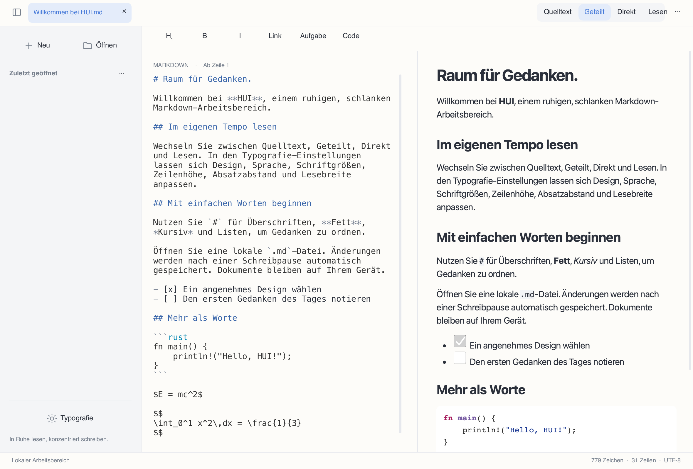

# HUI

[简体中文](README.md) · [繁體中文](README.zh-Hant.md) · [English](README.en.md) · [日本語](README.ja.md) · [한국어](README.ko.md) · [Français](README.fr.md) · [Deutsch](README.de.md) · [Русский](README.ru.md) · [Español](README.es.md)


Ein moderner, übersichtlicher Markdown-Editor und -Reader mit lokaler Datenhaltung, entwickelt mit **Rust + Slint + Blitz/Skia**, ohne WebView.



## Status

**Entwicklungsvorschau 0.2.0**. Desktop-Pakete sind verfügbar; einige Funktionen sind noch unvollständig. Android- und iOS-Apps sind noch nicht lieferbar.

## Funktionen

- Quelltext, geteilte Vorschau, Lesen und experimentelle Direktbearbeitung; proportionale Scroll-Synchronisierung in beide Richtungen.
- Oberfläche auf vereinfachtem und traditionellem Chinesisch, Englisch, Japanisch, Koreanisch, Französisch, Deutsch, Russisch und Spanisch. Standardmäßig gilt die Systemsprache; manuelle Auswahl unter Typografie.
- Mehrsprachiges UTF-8-Markdown, Syntaxhervorhebung, Tabellen, Aufgabenlisten, lokale Bilder, Formeln und native Mermaid-Diagramme.
- Helles, dunkles und Papierdesign; eigene Quelltextgröße sowie einstellbare Zeilenhöhe, Absatzabstände und Lesebreite.
- Lokale Dateien, Tabs, zuletzt geöffnete Dateien, Suchen/Ersetzen, Rückgängig/Wiederholen, automatisches Speichern nach Schreibpausen, Konfliktschutz und Wiederherstellung.
- Auswahl und Kopieren im Lesemodus, Kontextmenüs, Markdown-Tastenkürzel und HTML/PDF-Export.

## Herunterladen und starten

Wählen Sie Ihre Architektur unter [Releases](https://github.com/code592/HUI/releases). macOS: DMG öffnen und HUI nach Applications ziehen. Windows: die gesamte ZIP-Datei entpacken und hui.exe starten; DLLs und assets daneben belassen. Linux: die unten genannten Abhängigkeiten installieren, tar.gz entpacken und ./bin/hui starten. Die Pakete sind nicht offiziell signiert oder notarisiert.

## Plattformen

Das macOS-Paket ist für Apple Silicon; Windows und Linux bieten x64/ARM64. Grundlegende Laufzeitprüfungen erfolgten auf dem aktuellen Mac, einer Windows-11-ARM-VM (x64 mit Systememulation) und in Linux-Containern. Windows 10 LTSC 2021 / Windows 10 22H2, macOS 12/Intel, alle physischen Desktops und Mobilgeräte haben die Abnahme noch nicht abgeschlossen. Kompatibilitätsziele sind keine Prüfbestätigungen.

## Sprachen und Schriften

Die Systemsprache wird beim Start gelesen. Nicht unterstützte Sprachen fallen auf Englisch zurück. Chinesische Schrift- und Regionsangaben unterscheiden vereinfachtes und traditionelles Chinesisch. Die manuelle Auswahl bleibt gespeichert. Ein Sprachwechsel übersetzt oder verändert keine Dokumenttexte. CJK-Zeichen nutzen Ersatzschriften des Systems; auf minimalen Linux-Systemen Noto CJK installieren. Native Dialogschaltflächen stammen vom Betriebssystem.

## Kompilieren

Erforderlich sind Rust 1.98+, eine C/C++-Werkzeugkette, CMake, Python 3 und die Entwicklungsbibliotheken der Plattform. Windows benötigt die C++-Werkzeuge von Visual Studio 2022 und das passende SDK; mit PYTHON3 lässt sich der Interpreter festlegen. Beim ersten Build werden Abhängigkeiten und Skia-Binärdateien heruntergeladen.

```sh
cargo run -p hui-app -- path/to/document.md
cargo test --workspace --locked
python3 scripts/check-locales.py
```

Linux (Ubuntu 22.04 / 24.04):

```sh
sudo apt install build-essential clang cmake pkg-config python3 libfontconfig1-dev libxkbcommon-dev libxkbcommon-x11-0 libxcb-shape0-dev libxcb-xfixes0-dev libudev-dev libssl-dev libgl1 libegl1 fonts-noto-cjk
bash scripts/package-linux.sh
```

macOS:

```sh
HUI_DMG=1 bash scripts/package-macos.sh
```

Windows (Visual Studio Developer PowerShell):

```powershell
./scripts/package-windows.ps1 -Arch x64
./scripts/package-windows.ps1 -Arch arm64
```

## Bekannte Einschränkungen

Der Quelltexteditor nutzt eine begrenzte, seitenweise Ansicht; die Direktbearbeitung ist eine experimentelle Einzelblock-Implementierung. Durchgehende virtuelle Bearbeitung, mehrere Cursor und plattformübergreifende IME-Abnahme fehlen noch. Die Ziele für den ersten Bildaufbau bei 50 MB, Eingabe-/Scroll-Latenz und Energieverbrauch sind nicht durchgängig geprüft. Blitz HTML/CSS und merman wurden noch nicht streng mit offiziellen Ausgaben verglichen. Formeln nutzen KaTeX 0.16.22 zur Prüfung und MathJax 3.2.2 zur SVG-Anzeige, ohne strikte KaTeX-Gleichheit. PDF-Formeln sind Vektorpfade; Link-Anmerkungen, komplexe Seitenteilung und vollständig eingebettete HTML-Ressourcen bleiben unvollständig. Externe Ressourcen sind im nativen Lesemodus deaktiviert.

Beim Kopieren von PDF-Text können einzelne CJK- und kyrillische Zeichen durch optisch gleiche Unicode-Zeichen ersetzt werden; exakte Zeichentreue im exportierten PDF ist nicht garantiert.

## Beiträge und Lizenzen

Der eigene HUI-Quellcode steht unter [MIT](LICENSE). Abhängigkeiten, Schriften und Ressourcen behalten ihre jeweiligen Lizenzen; siehe [THIRD_PARTY.md](THIRD_PARTY.md). Fehlermeldungen sollten Plattform, Architektur, Version und ein minimales Beispieldokument ohne private Inhalte enthalten. Details zu offenen Punkten stehen in [docs/STATUS.md](docs/STATUS.md) (Chinesisch).

[](https://slint.dev)
