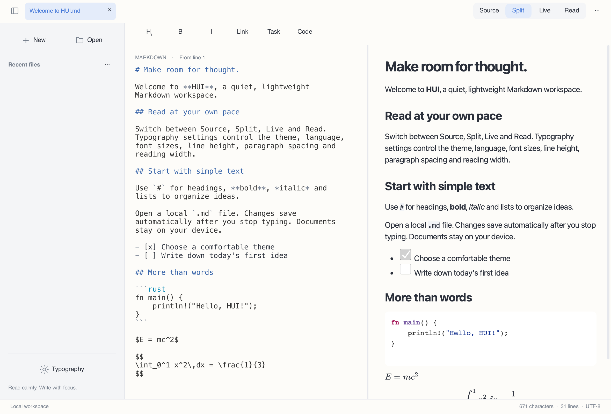

# HUI

[简体中文](README.md) · [繁體中文](README.zh-Hant.md) · [English](README.en.md) · [日本語](README.ja.md) · [한국어](README.ko.md) · [Français](README.fr.md) · [Deutsch](README.de.md) · [Русский](README.ru.md) · [Español](README.es.md)


A modern, clean, local-first Markdown editor and reader built with **Rust + Slint + Blitz/Skia**, without a WebView.



## Status

**0.2.0 development preview**. Desktop builds are available with documented gaps. Android and iOS apps are not yet deliverable.

## Features

- Source, split preview, reading and experimental live editing; proportional scroll synchronization in both directions.
- Simplified Chinese, Traditional Chinese, English, Japanese, Korean, French, German, Russian and Spanish UI; follows the system by default, with an override in Typography.
- UTF-8 multilingual Markdown, syntax highlighting, tables, task lists, local images, mathematics and native Mermaid diagrams.
- Light, dark and paper themes; separate source font size, text line height, paragraph spacing and reading width.
- Local files, tabs, recent files, find/replace, undo/redo, autosave after a typing pause, conflict protection and recovery.
- Reading selection and copy, context menus, Markdown shortcuts and HTML/PDF export.

## Download and run

Choose your architecture in [Releases](https://github.com/code592/HUI/releases). macOS: open the DMG and drag HUI to Applications. Windows: extract the entire ZIP and run hui.exe; keep the DLLs and assets alongside it. Linux: extract the tar.gz and run ./bin/hui after installing the dependencies below. Packages are not officially signed or notarized.

## Platforms

The macOS package targets Apple Silicon; Windows and Linux packages target x64/ARM64. Basic runtime checks use the current macOS host, a Windows 11 ARM VM (x64 under system emulation) and Linux containers. Windows 10 LTSC 2021 / Windows 10 22H2, macOS 12/Intel, all physical desktops and mobile devices have not completed acceptance testing. Compatibility targets are not verification claims.

## Languages and fonts

The UI reads the system language at startup and falls back to English for unsupported languages. Chinese script and regional variants distinguish simplified from traditional. Manual choices persist. Changing UI language never translates or rewrites document text. CJK glyphs use system font fallback; install Noto CJK on minimal Linux systems. Native dialog buttons are provided by the operating system.

## Build

Requires Rust 1.98+, a C/C++ toolchain, CMake, Python 3 and platform development libraries. Windows needs the Visual Studio 2022 C++ tools and matching SDK; PYTHON3 can select the interpreter. The first build downloads dependencies and Skia binaries.

```sh
cargo run -p hui-app -- path/to/document.md
cargo test --workspace --locked
python3 scripts/check-locales.py
```

Linux (Ubuntu 22.04 / 24.04):

```sh
sudo apt install build-essential clang cmake pkg-config python3 libfontconfig1-dev libxkbcommon-dev libxkbcommon-x11-0 libxcb-shape0-dev libxcb-xfixes0-dev libudev-dev libssl-dev libgl1 libegl1 fonts-noto-cjk
bash scripts/package-linux.sh
```

macOS:

```sh
HUI_DMG=1 bash scripts/package-macos.sh
```

Windows (Visual Studio Developer PowerShell):

```powershell
./scripts/package-windows.ps1 -Arch x64
./scripts/package-windows.ps1 -Arch arm64
```

## Known limitations

Source editing uses a bounded paged viewport and live editing is an experimental single-block implementation. Continuous virtual editing, multiple cursors and cross-platform IME acceptance are unfinished. The 50 MB first-screen, input/scroll latency and energy targets have not been verified end to end. Blitz HTML/CSS and merman have not passed strict official-output comparisons. Mathematics uses KaTeX 0.16.22 validation and MathJax 3.2.2 SVG display, not strict KaTeX equivalence. PDF formulas are vector paths; link annotations, complex pagination and self-contained HTML export resources remain incomplete. Remote resources are disabled in native reading.

PDF text copying can still substitute visually identical Unicode characters, observed with some CJK and Cyrillic glyphs; exact character fidelity in exported PDF text is not guaranteed.

## Contributing and licensing

HUI's own source is [MIT](LICENSE). Dependencies, fonts and bundled assets retain their respective licenses; see [THIRD_PARTY.md](THIRD_PARTY.md). Issues and improvements are welcome. Include platform, architecture, version and a minimal reproducer with private content removed. Detailed implementation gaps are recorded in [docs/STATUS.md](docs/STATUS.md) (Chinese).

[](https://slint.dev)
