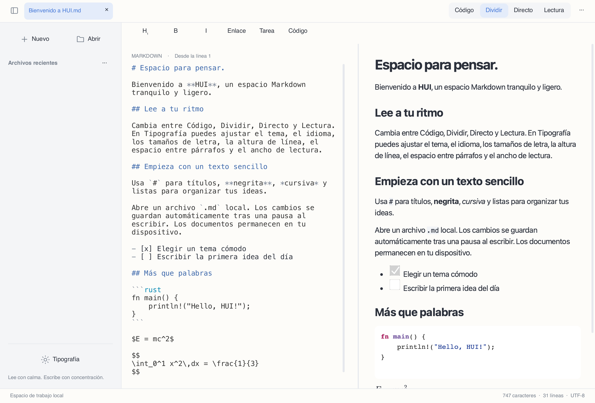

# HUI

[简体中文](README.md) · [繁體中文](README.zh-Hant.md) · [English](README.en.md) · [日本語](README.ja.md) · [한국어](README.ko.md) · [Français](README.fr.md) · [Deutsch](README.de.md) · [Русский](README.ru.md) · [Español](README.es.md)


Un editor y lector Markdown moderno, limpio y local, creado con **Rust + Slint + Blitz/Skia**, sin WebView.



## Estado

**Versión preliminar de desarrollo 0.2.0**. Hay paquetes de escritorio disponibles, con funciones aún incompletas. Las aplicaciones Android e iOS todavía no están listas para distribuirse.

## Funciones

- Código, vista dividida, lectura y edición directa experimental; sincronización proporcional del desplazamiento en ambas direcciones.
- Interfaz en chino simplificado y tradicional, inglés, japonés, coreano, francés, alemán, ruso y español. Sigue el idioma del sistema por defecto; se puede elegir otro en Tipografía.
- Markdown multilingüe UTF-8, resaltado de sintaxis, tablas, listas de tareas, imágenes locales, fórmulas y diagramas Mermaid nativos.
- Temas claro, oscuro y papel; tamaño del código independiente, altura de línea, espacio entre párrafos y ancho de lectura ajustables.
- Archivos locales, pestañas, archivos recientes, búsqueda y reemplazo, deshacer/rehacer, guardado automático tras una pausa, protección de conflictos y recuperación.
- Selección y copia en lectura, menús contextuales, atajos Markdown y exportación HTML/PDF.

## Descargar y ejecutar

Elige tu arquitectura en [Releases](https://github.com/code592/HUI/releases). macOS: abre el DMG y arrastra HUI a Applications. Windows: extrae todo el ZIP y ejecuta hui.exe; conserva las DLL y assets a su lado. Linux: instala las dependencias siguientes, extrae el tar.gz y ejecuta ./bin/hui. Los paquetes no tienen firma oficial ni notarización.

## Plataformas

El paquete macOS es para Apple Silicon; Windows y Linux ofrecen x64/ARM64. Se han realizado comprobaciones básicas en el Mac actual, una VM Windows 11 ARM (x64 mediante emulación del sistema) y contenedores Linux. Windows 10 LTSC 2021 / Windows 10 22H2, macOS 12/Intel y todos los equipos físicos y móviles aún no han completado las pruebas de aceptación. Un objetivo de compatibilidad no equivale a una verificación.

## Idiomas y fuentes

La interfaz lee el idioma del sistema al iniciar y usa inglés si no está admitido. La escritura y la región distinguen el chino simplificado del tradicional. La selección manual se conserva. Cambiar el idioma no traduce ni reescribe el documento. Los caracteres CJK usan fuentes alternativas del sistema; instala Noto CJK en sistemas Linux mínimos. Los botones de los diálogos nativos los proporciona el sistema operativo.

## Compilar

Requiere Rust 1.98+, herramientas C/C++, CMake, Python 3 y bibliotecas de desarrollo de la plataforma. Windows necesita las herramientas C++ de Visual Studio 2022 y el SDK correspondiente; PYTHON3 permite elegir el intérprete. La primera compilación descarga dependencias y binarios de Skia.

```sh
cargo run -p hui-app -- path/to/document.md
cargo test --workspace --locked
python3 scripts/check-locales.py
```

Linux (Ubuntu 22.04 / 24.04):

```sh
sudo apt install build-essential clang cmake pkg-config python3 libfontconfig1-dev libxkbcommon-dev libxkbcommon-x11-0 libxcb-shape0-dev libxcb-xfixes0-dev libudev-dev libssl-dev libgl1 libegl1 fonts-noto-cjk
bash scripts/package-linux.sh
```

macOS:

```sh
HUI_DMG=1 bash scripts/package-macos.sh
```

Windows (Visual Studio Developer PowerShell):

```powershell
./scripts/package-windows.ps1 -Arch x64
./scripts/package-windows.ps1 -Arch arm64
```

## Limitaciones conocidas

La edición de código utiliza una vista paginada limitada y la edición directa es una implementación experimental de un solo bloque. La edición virtual continua, varios cursores y la validación de IME en todas las plataformas están pendientes. Los objetivos de primera pantalla para 50 MB, latencia y consumo energético no se han verificado de extremo a extremo. Blitz HTML/CSS y merman no han superado una comparación estricta con los resultados oficiales. Las fórmulas usan KaTeX 0.16.22 para validar y MathJax 3.2.2 para mostrar SVG, sin equivalencia estricta con KaTeX. Las fórmulas PDF son trazados vectoriales; las anotaciones de enlaces, la paginación compleja y los recursos HTML autocontenidos siguen incompletos. Los recursos remotos están desactivados en la lectura nativa.

Al copiar texto PDF, algunos caracteres CJK y cirílicos pueden sustituirse por caracteres Unicode visualmente idénticos; no se garantiza la fidelidad exacta de los caracteres exportados.

## Contribuciones y licencias

El código propio de HUI usa [MIT](LICENSE). Las dependencias, fuentes y recursos conservan sus licencias; consulta [THIRD_PARTY.md](THIRD_PARTY.md). Al informar de un problema, incluye plataforma, arquitectura, versión y un documento mínimo sin contenido privado. Los detalles pendientes están en [docs/STATUS.md](docs/STATUS.md) (chino).

[](https://slint.dev)
