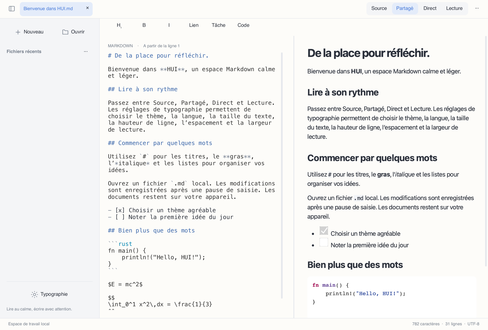

# HUI

[简体中文](README.md) · [繁體中文](README.zh-Hant.md) · [English](README.en.md) · [日本語](README.ja.md) · [한국어](README.ko.md) · [Français](README.fr.md) · [Deutsch](README.de.md) · [Русский](README.ru.md) · [Español](README.es.md)


Un éditeur et lecteur Markdown moderne, sobre et local, construit avec **Rust + Slint + Blitz/Skia**, sans WebView.



## État

**Aperçu de développement 0.2.0**. Des versions de bureau sont disponibles, avec des fonctions encore incomplètes. Les applications Android et iOS ne sont pas encore livrables.

## Fonctions

- Source, aperçu partagé, lecture et édition directe expérimentale ; synchronisation proportionnelle du défilement dans les deux sens.
- Interface en chinois simplifié et traditionnel, anglais, japonais, coréen, français, allemand, russe et espagnol. La langue du système est utilisée par défaut, avec un choix manuel dans Typographie.
- Markdown multilingue UTF-8, coloration syntaxique, tableaux, listes de tâches, images locales, formules et diagrammes Mermaid natifs.
- Thèmes clair, sombre et papier ; taille du code, hauteur de ligne, espacement des paragraphes et largeur de lecture réglables.
- Fichiers locaux, onglets, fichiers récents, recherche/remplacement, annulation/rétablissement, enregistrement automatique après une pause, protection contre les conflits et récupération.
- Sélection et copie en lecture, menus contextuels, raccourcis Markdown et export HTML/PDF.

## Télécharger et lancer

Choisissez votre architecture dans [Releases](https://github.com/code592/HUI/releases). macOS : ouvrez le DMG et glissez HUI dans Applications. Windows : extrayez tout le ZIP puis lancez hui.exe ; conservez les DLL et assets à côté. Linux : installez les dépendances ci-dessous, extrayez le tar.gz puis lancez ./bin/hui. Les paquets ne sont pas officiellement signés ni notariés.

## Plateformes

Le paquet macOS vise Apple Silicon ; Windows et Linux proposent x64/ARM64. Des contrôles de base ont été réalisés sur le Mac actuel, une VM Windows 11 ARM (x64 sous émulation système) et des conteneurs Linux. Windows 10 LTSC 2021 / Windows 10 22H2, macOS 12/Intel, l’ensemble des bureaux physiques et les appareils mobiles n’ont pas terminé les tests d’acceptation. Une cible de compatibilité n’est pas une validation.

## Langues et polices

L’interface lit la langue du système au démarrage et utilise l’anglais si elle n’est pas prise en charge. L’écriture et la région distinguent le chinois simplifié du traditionnel. Le choix manuel est conservé. Changer la langue de l’interface ne traduit ni ne réécrit les documents. Les caractères CJK utilisent les polices de secours du système ; installez Noto CJK sur un Linux minimal. Les boutons des boîtes de dialogue natives sont fournis par le système.

## Compilation

Rust 1.98+, une chaîne C/C++, CMake, Python 3 et les bibliothèques de développement de la plateforme sont nécessaires. Sous Windows, utilisez les outils C++ de Visual Studio 2022 et le SDK adapté ; PYTHON3 permet de choisir l’interpréteur. La première compilation télécharge les dépendances et les binaires Skia.

```sh
cargo run -p hui-app -- path/to/document.md
cargo test --workspace --locked
python3 scripts/check-locales.py
```

Linux (Ubuntu 22.04 / 24.04):

```sh
sudo apt install build-essential clang cmake pkg-config python3 libfontconfig1-dev libxkbcommon-dev libxkbcommon-x11-0 libxcb-shape0-dev libxcb-xfixes0-dev libudev-dev libssl-dev libgl1 libegl1 fonts-noto-cjk
bash scripts/package-linux.sh
```

macOS:

```sh
HUI_DMG=1 bash scripts/package-macos.sh
```

Windows (Visual Studio Developer PowerShell):

```powershell
./scripts/package-windows.ps1 -Arch x64
./scripts/package-windows.ps1 -Arch arm64
```

## Limites connues

L’édition source utilise une vue paginée de taille limitée ; l’édition directe est une implémentation expérimentale à bloc unique. L’édition virtuelle continue, les curseurs multiples et la validation des méthodes de saisie restent inachevés. Les objectifs de premier affichage à 50 Mo, de latence et de consommation n’ont pas été vérifiés de bout en bout. Blitz HTML/CSS et merman n’ont pas passé de comparaison stricte avec les sorties officielles. Les formules utilisent KaTeX 0.16.22 pour la validation et MathJax 3.2.2 pour le SVG, sans équivalence stricte à KaTeX. Dans les PDF, les formules sont des tracés vectoriels ; les annotations de liens, la pagination complexe et l’inclusion complète des ressources HTML restent incomplètes. Les ressources distantes sont désactivées en lecture native.

La copie du texte PDF peut remplacer certains caractères CJK et cyrilliques par des caractères Unicode visuellement identiques ; la fidélité exacte des caractères exportés n’est pas garantie.

## Contribuer et licences

Le code propre à HUI est sous [MIT](LICENSE). Les dépendances, polices et ressources conservent leurs licences respectives ; voir [THIRD_PARTY.md](THIRD_PARTY.md). Pour signaler un problème, indiquez la plateforme, l’architecture, la version et un document minimal sans données privées. Les limites détaillées figurent dans [docs/STATUS.md](docs/STATUS.md) (chinois).

[](https://slint.dev)
