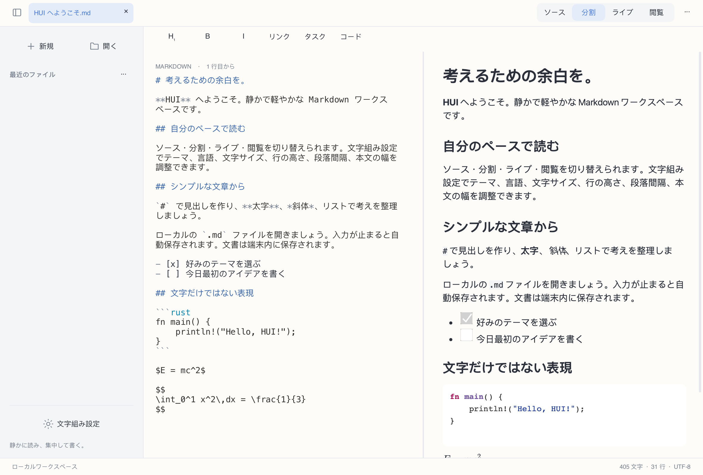

# HUI

[简体中文](README.md) · [繁體中文](README.zh-Hant.md) · [English](README.en.md) · [日本語](README.ja.md) · [한국어](README.ko.md) · [Français](README.fr.md) · [Deutsch](README.de.md) · [Русский](README.ru.md) · [Español](README.es.md)


**Rust + Slint + Blitz/Skia** で作られた、モダンでシンプルなローカル優先の Markdown エディター兼リーダーです。WebView は使用しません。



## 状態

**0.2.0 開発プレビュー**。デスクトップ版を提供していますが、未実装の機能があります。Android/iOS 版はまだ提供できません。

## 機能

- ソース、分割プレビュー、閲覧、試験的なライブ編集。分割表示はスクロール比率で双方向に同期します。
- 簡体字中国語、繁体字中国語、英語、日本語、韓国語、フランス語、ドイツ語、ロシア語、スペイン語の UI。標準ではシステム言語に従い、文字組み設定で変更できます。
- UTF-8 多言語 Markdown、構文強調、表、タスクリスト、ローカル画像、数式、ネイティブ Mermaid 図。
- ライト、ダーク、ペーパーのテーマ。ソースの文字サイズ、本文の行の高さ、段落間隔、閲覧幅を個別に設定できます。
- ローカルファイル、タブ、最近のファイル、検索と置換、元に戻す／やり直す、入力停止後の自動保存、競合保護、復元。
- 閲覧中の選択とコピー、コンテキストメニュー、Markdown ショートカット、HTML/PDF 書き出し。

## ダウンロードと実行

[Releases](https://github.com/code592/HUI/releases) でアーキテクチャに合うパッケージを選んでください。macOS：DMG を開き HUI を Applications にドラッグします。Windows：ZIP 全体を展開して hui.exe を実行します。DLL と assets は隣に置いてください。Linux：下記の依存ライブラリを入れ、tar.gz を展開して ./bin/hui を実行します。正式な署名・公証は行っていません。

## プラットフォーム

macOS は Apple Silicon、Windows と Linux は x64/ARM64 向けです。現在の macOS、Windows 11 ARM 仮想マシン（x64 はシステムのエミュレーション）、Linux コンテナーで基本動作を確認しています。Windows 10 LTSC 2021 / Windows 10 22H2、macOS 12/Intel、すべての実機やモバイル端末の受け入れ試験は未完了です。対応目標は検証済みという意味ではありません。

## 言語とフォント

起動時にシステム言語を読み、未対応言語は英語に戻ります。中国語は地域・文字体系から簡体字／繁体字を判定します。手動選択は保存されます。UI 言語を変えても文書は翻訳・書き換えされません。CJK 文字はシステムの代替フォントを使います。最小構成の Linux では Noto CJK を入れてください。ネイティブダイアログのボタンは OS が提供します。

## ビルド

Rust 1.98+、C/C++ ツールチェーン、CMake、Python 3、各プラットフォームの開発ライブラリが必要です。Windows は Visual Studio 2022 C++ ツールと対応 SDK を使用します。PYTHON3 で Python を指定できます。初回は依存関係と Skia バイナリをダウンロードします。

```sh
cargo run -p hui-app -- path/to/document.md
cargo test --workspace --locked
python3 scripts/check-locales.py
```

Linux (Ubuntu 22.04 / 24.04):

```sh
sudo apt install build-essential clang cmake pkg-config python3 libfontconfig1-dev libxkbcommon-dev libxkbcommon-x11-0 libxcb-shape0-dev libxcb-xfixes0-dev libudev-dev libssl-dev libgl1 libegl1 fonts-noto-cjk
bash scripts/package-linux.sh
```

macOS:

```sh
HUI_DMG=1 bash scripts/package-macos.sh
```

Windows (Visual Studio Developer PowerShell):

```powershell
./scripts/package-windows.ps1 -Arch x64
./scripts/package-windows.ps1 -Arch arm64
```

## 既知の制限

ソース編集は上限付きのページ単位の表示で、ライブ編集は単一ブロックの試験実装です。連続した仮想編集、複数カーソル、各 OS の IME 検証は未完了です。50 MB 文書の初期表示、入力・スクロール遅延、消費電力の目標は全体として未検証です。Blitz HTML/CSS と merman は公式出力との厳密な比較を完了していません。数式は KaTeX 0.16.22 で検証し MathJax 3.2.2 の SVG で表示するため、KaTeX と厳密に同等ではありません。PDF の数式はベクターパスです。リンク注釈、複雑な改ページ、HTML 書き出しのリソース内包は不完全です。ネイティブ閲覧ではリモートリソースを無効にしています。

PDF の文字コピーでは、一部の漢字やキリル文字が同じ字形の別の Unicode 文字に置き換わる場合があります。書き出した PDF の文字単位の忠実性は保証していません。

## 開発への参加とライセンス

HUI 独自のソースは [MIT](LICENSE) です。依存関係、フォント、同梱リソースには各ライセンスが適用されます。[THIRD_PARTY.md](THIRD_PARTY.md) を参照してください。問題報告には OS、アーキテクチャ、バージョン、個人情報を除いた最小の再現文書を添えてください。詳細な未完了項目は [docs/STATUS.md](docs/STATUS.md)（中国語）に記録しています。

[](https://slint.dev)
