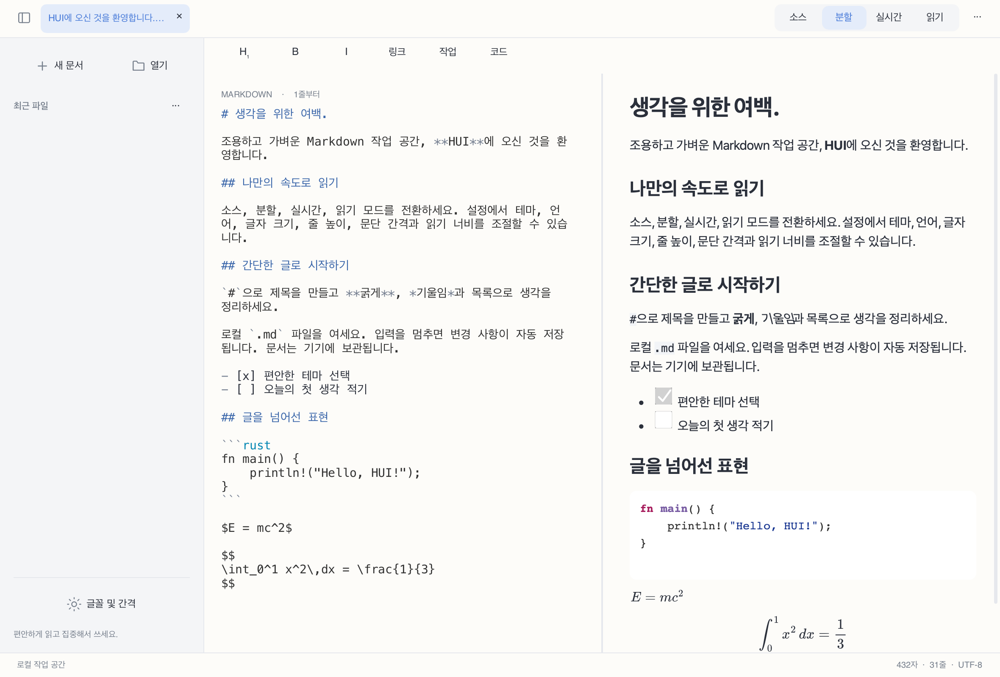

# HUI

[简体中文](README.md) · [繁體中文](README.zh-Hant.md) · [English](README.en.md) · [日本語](README.ja.md) · [한국어](README.ko.md) · [Français](README.fr.md) · [Deutsch](README.de.md) · [Русский](README.ru.md) · [Español](README.es.md)


**Rust + Slint + Blitz/Skia**로 만든 현대적이고 깔끔한 로컬 우선 Markdown 편집기 및 리더입니다. WebView를 사용하지 않습니다.



## 상태

**0.2.0 개발 미리 보기**. 데스크톱 빌드를 제공하지만 아직 미완성 기능이 있습니다. Android/iOS 앱은 아직 제공하지 않습니다.

## 기능

- 소스, 분할 미리 보기, 읽기와 실험적인 실시간 편집. 분할 화면은 스크롤 비율로 양방향 동기화됩니다.
- 중국어 간체·번체, 영어, 일본어, 한국어, 프랑스어, 독일어, 러시아어, 스페인어 UI. 기본적으로 시스템 언어를 따르며 설정에서 변경할 수 있습니다.
- UTF-8 다국어 Markdown, 구문 강조, 표, 작업 목록, 로컬 이미지, 수식 및 네이티브 Mermaid 다이어그램.
- 밝게, 어둡게, 종이 테마. 소스 글자 크기, 본문 줄 높이, 문단 간격과 읽기 너비를 따로 설정할 수 있습니다.
- 로컬 파일, 탭, 최근 파일, 찾기/바꾸기, 실행 취소/다시 실행, 입력 중단 후 자동 저장, 충돌 보호 및 복구.
- 읽기 선택 및 복사, 상황에 맞는 메뉴, Markdown 단축키, HTML/PDF 내보내기.

## 다운로드 및 실행

[Releases](https://github.com/code592/HUI/releases)에서 아키텍처를 선택하세요. macOS: DMG를 열고 HUI를 Applications로 드래그합니다. Windows: ZIP 전체를 풀고 hui.exe를 실행합니다. DLL과 assets를 함께 유지하세요. Linux: 아래 의존성을 설치한 뒤 tar.gz를 풀고 ./bin/hui를 실행합니다. 패키지는 공식 서명이나 공증을 받지 않았습니다.

## 플랫폼

macOS 패키지는 Apple Silicon용이며 Windows와 Linux는 x64/ARM64용입니다. 현재 macOS, Windows 11 ARM 가상 머신(x64는 시스템 에뮬레이션), Linux 컨테이너에서 기본 실행을 확인했습니다. Windows 10 LTSC 2021 / Windows 10 22H2, macOS 12/Intel, 모든 실제 데스크톱 및 모바일 기기의 인수 테스트는 완료되지 않았습니다. 호환성 목표가 검증 완료를 뜻하지는 않습니다.

## 언어와 글꼴

시작 시 시스템 언어를 읽고 지원하지 않는 언어는 영어로 표시합니다. 중국어는 지역과 문자 체계로 간체·번체를 구분합니다. 수동 선택은 저장됩니다. UI 언어를 바꿔도 문서 내용을 번역하거나 다시 쓰지 않습니다. CJK 문자는 시스템 대체 글꼴을 사용합니다. 최소 구성 Linux에는 Noto CJK를 설치하세요. 네이티브 대화 상자의 버튼은 운영체제가 제공합니다.

## 빌드

Rust 1.98+, C/C++ 도구 체인, CMake, Python 3 및 플랫폼 개발 라이브러리가 필요합니다. Windows는 Visual Studio 2022 C++ 도구와 해당 SDK를 사용합니다. PYTHON3로 인터프리터를 지정할 수 있습니다. 첫 빌드에서 의존성과 Skia 바이너리를 다운로드합니다.

```sh
cargo run -p hui-app -- path/to/document.md
cargo test --workspace --locked
python3 scripts/check-locales.py
```

Linux (Ubuntu 22.04 / 24.04):

```sh
sudo apt install build-essential clang cmake pkg-config python3 libfontconfig1-dev libxkbcommon-dev libxkbcommon-x11-0 libxcb-shape0-dev libxcb-xfixes0-dev libudev-dev libssl-dev libgl1 libegl1 fonts-noto-cjk
bash scripts/package-linux.sh
```

macOS:

```sh
HUI_DMG=1 bash scripts/package-macos.sh
```

Windows (Visual Studio Developer PowerShell):

```powershell
./scripts/package-windows.ps1 -Arch x64
./scripts/package-windows.ps1 -Arch arm64
```

## 알려진 제한

소스 편집은 크기가 제한된 페이지형 뷰포트를 사용하며 실시간 편집은 단일 블록 실험 구현입니다. 연속 가상 편집, 다중 커서 및 플랫폼별 IME 검증은 미완료입니다. 50 MB 첫 화면, 입력·스크롤 지연, 에너지 목표는 전체 과정에서 검증되지 않았습니다. Blitz HTML/CSS와 merman은 공식 출력과의 엄격한 비교를 통과하지 않았습니다. 수식은 KaTeX 0.16.22 검증과 MathJax 3.2.2 SVG 표시를 사용하므로 KaTeX와 엄밀히 동일하지 않습니다. PDF 수식은 벡터 경로이며 링크 주석, 복잡한 페이지 나눔, HTML 리소스 포함은 미완성입니다. 네이티브 읽기에서 원격 리소스는 비활성화됩니다.

PDF 텍스트 복사 시 일부 한자 및 키릴 문자가 모양이 같은 다른 Unicode 문자로 바뀔 수 있습니다. 내보낸 PDF의 문자 단위 일치 여부는 보장하지 않습니다.

## 기여와 라이선스

HUI 자체 소스는 [MIT](LICENSE)입니다. 의존성, 글꼴 및 번들 리소스는 각각의 라이선스를 따릅니다. [THIRD_PARTY.md](THIRD_PARTY.md)를 참조하세요. 문제를 보고할 때 플랫폼, 아키텍처, 버전과 개인 정보를 제거한 최소 재현 문서를 포함해 주세요. 자세한 미완료 항목은 [docs/STATUS.md](docs/STATUS.md)(중국어)에 기록되어 있습니다.

[](https://slint.dev)
