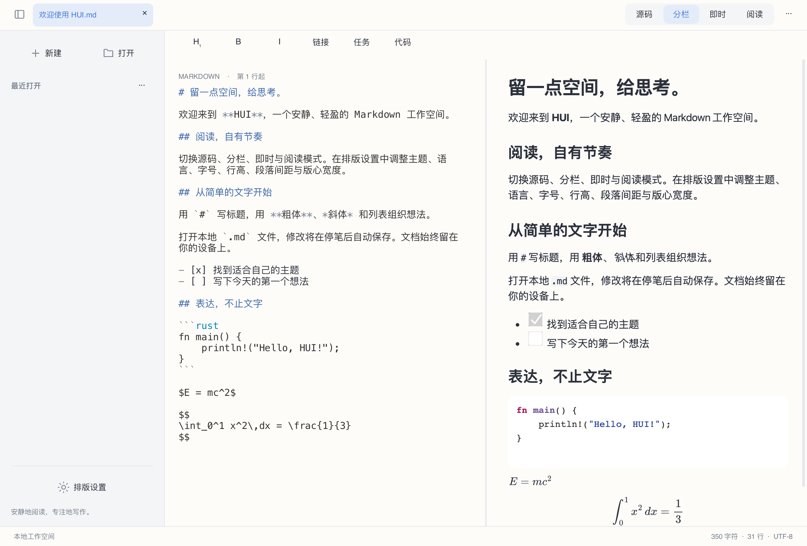

# HUI

[简体中文](README.md) · [繁體中文](README.zh-Hant.md) · [English](README.en.md) · [日本語](README.ja.md) · [한국어](README.ko.md) · [Français](README.fr.md) · [Deutsch](README.de.md) · [Русский](README.ru.md) · [Español](README.es.md)


现代、简洁、本地优先的 Markdown 编辑与阅读工具。使用 **Rust + Slint + Blitz/Skia**，不使用 WebView。



## 状态

**0.2.0 开发预览**。桌面可用，仍有明确的未完成项；Android/iOS 尚无可交付应用。

## 功能

- 源码、分栏预览、阅读及实验性即时编辑；分栏按滚动比例双向联动。
- 简体中文、繁体中文、英语、日语、韩语、法语、德语、俄语、西班牙语界面，默认跟随系统，可在排版设置中切换。
- UTF-8 多语言 Markdown、代码高亮、表格、任务列表、本地图片、数学公式与原生 Mermaid 图表。
- 暖白、石墨、暖纸主题，独立源码字号，正文行高、段落间距与阅读宽度设置。
- 本地文件、多标签、最近文件、查找替换、撤销重做、停笔自动保存、冲突保护与恢复。
- 阅读选择复制、右键菜单、Markdown 格式快捷键、HTML/PDF 导出。

## 下载与运行

在 [Releases](https://github.com/code592/HUI/releases) 下载对应架构。macOS：打开 DMG，将 HUI 拖到 Applications。Windows：完整解压 ZIP 后运行 hui.exe；请保留旁边的 DLL 和 assets。Linux：解压 tar.gz，运行 ./bin/hui，先安装下方依赖。安装包未作正式开发者签名或公证。

## 平台

macOS 包为 Apple Silicon；Windows 和 Linux 提供 x64/ARM64。已在当前 macOS、Windows 11 ARM 虚拟机（x64 通过系统仿真）及 Linux 容器中做基础运行检查。Windows 10 LTSC 2021 / Windows 10 22H2、macOS 12/Intel、全部真实桌面与移动设备尚未完整验收。目标兼容性不等于已经验证。

## 语言与字体

界面首次启动跟随系统语言；不支持的系统语言回退英语。中文按简繁地区/脚本识别，手动选择会持久保存。系统语言在启动时读取。切换界面不会翻译或改写文档。中日韩字体使用系统回退；精简 Linux 系统应安装 Noto CJK。原生系统对话框按钮由操作系统提供。

## 构建

需要 Rust 1.98+、C/C++ 工具链、CMake、Python 3 和平台开发依赖。Windows 使用 Visual Studio 2022 C++ 工具链与对应架构 SDK；可用 PYTHON3 指定 Python。首次构建会下载依赖与 Skia 二进制。

```sh
cargo run -p hui-app -- path/to/document.md
cargo test --workspace --locked
python3 scripts/check-locales.py
```

Linux (Ubuntu 22.04 / 24.04):

```sh
sudo apt install build-essential clang cmake pkg-config python3 libfontconfig1-dev libxkbcommon-dev libxkbcommon-x11-0 libxcb-shape0-dev libxcb-xfixes0-dev libudev-dev libssl-dev libgl1 libegl1 fonts-noto-cjk
bash scripts/package-linux.sh
```

macOS:

```sh
HUI_DMG=1 bash scripts/package-macos.sh
```

Windows (Visual Studio Developer PowerShell):

```powershell
./scripts/package-windows.ps1 -Arch x64
./scripts/package-windows.ps1 -Arch arm64
```

## 已知限制

源码编辑仍采用有界分页视口，即时模式为单块实验实现，完整连续虚拟编辑、多光标和输入法跨平台验收未完成。50 MB 首屏、输入/滚动延迟及能耗目标尚未端到端验证。Blitz HTML/CSS、merman 与 Mermaid 官方输出尚未严格对照；公式采用 KaTeX 0.16.22 校验及 MathJax 3.2.2 SVG 显示，并非严格 KaTeX 等效。PDF 中公式是矢量路径，链接注释、复杂分页和 HTML 导出资源自包含仍不完整。远程资源在原生阅读中禁用。

PDF 文本复制还存在少数字形相同但 Unicode 码位不同的替换（已在部分汉字和俄语字符中观察到），暂不保证导出后的逐字符复制保真。

## 开发与许可证

HUI 自有源码采用 [MIT](LICENSE)。依赖、字体和附带资源各自遵循其许可证，见 [THIRD_PARTY.md](THIRD_PARTY.md)。欢迎提交问题和改进；请提供平台、架构、版本及最小复现文档，并去除私人内容。详细边界见 [docs/STATUS.md](docs/STATUS.md)。

[](https://slint.dev)
