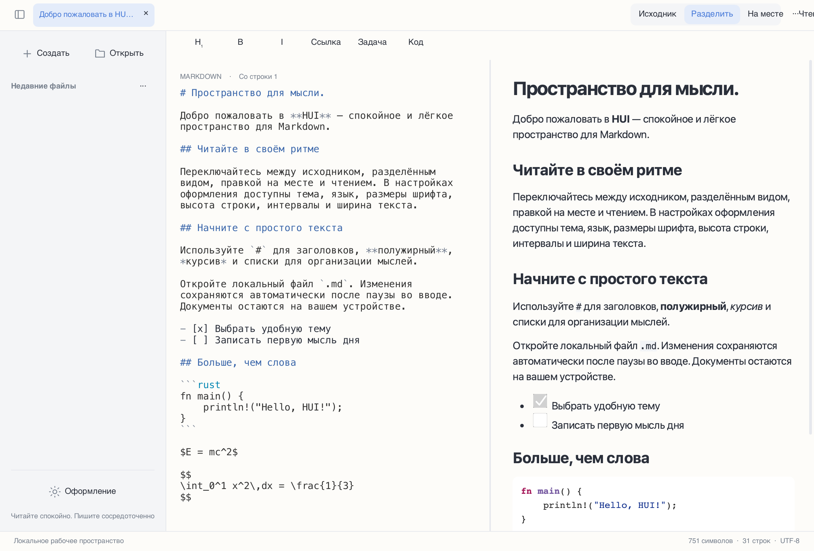

# HUI

[简体中文](README.md) · [繁體中文](README.zh-Hant.md) · [English](README.en.md) · [日本語](README.ja.md) · [한국어](README.ko.md) · [Français](README.fr.md) · [Deutsch](README.de.md) · [Русский](README.ru.md) · [Español](README.es.md)


Современный и лаконичный редактор и просмотрщик Markdown с локальным хранением, созданный на **Rust + Slint + Blitz/Skia**, без WebView.



## Состояние

**Предварительная версия 0.2.0 для разработки**. Доступны настольные сборки, но часть возможностей ещё не завершена. Приложения для Android и iOS пока не готовы к поставке.

## Возможности

- Исходник, разделённый просмотр, чтение и экспериментальная правка на месте; двусторонняя пропорциональная синхронизация прокрутки.
- Интерфейс на упрощённом и традиционном китайском, английском, японском, корейском, французском, немецком, русском и испанском. По умолчанию используется язык системы; выбор доступен в настройках оформления.
- Многоязычный Markdown в UTF-8, подсветка кода, таблицы, списки задач, локальные изображения, формулы и нативные диаграммы Mermaid.
- Светлая, тёмная и бумажная темы; отдельный размер шрифта исходника, высота строки, интервалы абзацев и ширина текста.
- Локальные файлы, вкладки, недавние файлы, поиск/замена, отмена/повтор, автосохранение после паузы ввода, защита от конфликтов и восстановление.
- Выделение и копирование при чтении, контекстные меню, сочетания клавиш Markdown и экспорт HTML/PDF.

## Загрузка и запуск

Выберите архитектуру в [Releases](https://github.com/code592/HUI/releases). macOS: откройте DMG и перетащите HUI в Applications. Windows: распакуйте весь ZIP и запустите hui.exe; сохраните DLL и assets рядом. Linux: установите зависимости ниже, распакуйте tar.gz и запустите ./bin/hui. Пакеты не имеют официальной подписи и нотариального заверения Apple.

## Платформы

Пакет macOS предназначен для Apple Silicon; Windows и Linux — для x64/ARM64. Базовые проверки выполнены на текущем Mac, в виртуальной машине Windows 11 ARM (x64 через системную эмуляцию) и контейнерах Linux. Windows 10 LTSC 2021 / Windows 10 22H2, macOS 12/Intel, все физические настольные и мобильные устройства ещё не прошли полную приёмку. Целевая совместимость не означает подтверждённую проверку.

## Языки и шрифты

Язык системы определяется при запуске; для неподдерживаемых языков используется английский. Китайская письменность и регион различают упрощённый и традиционный варианты. Ручной выбор сохраняется. Смена языка интерфейса не переводит и не переписывает документ. Для CJK используются резервные системные шрифты; в минимальном Linux установите Noto CJK. Кнопки нативных диалогов предоставляет ОС.

## Сборка

Нужны Rust 1.98+, инструменты C/C++, CMake, Python 3 и библиотеки разработки платформы. В Windows требуются инструменты C++ Visual Studio 2022 и соответствующий SDK; интерпретатор можно задать через PYTHON3. При первой сборке загружаются зависимости и бинарные файлы Skia.

```sh
cargo run -p hui-app -- path/to/document.md
cargo test --workspace --locked
python3 scripts/check-locales.py
```

Linux (Ubuntu 22.04 / 24.04):

```sh
sudo apt install build-essential clang cmake pkg-config python3 libfontconfig1-dev libxkbcommon-dev libxkbcommon-x11-0 libxcb-shape0-dev libxcb-xfixes0-dev libudev-dev libssl-dev libgl1 libegl1 fonts-noto-cjk
bash scripts/package-linux.sh
```

macOS:

```sh
HUI_DMG=1 bash scripts/package-macos.sh
```

Windows (Visual Studio Developer PowerShell):

```powershell
./scripts/package-windows.ps1 -Arch x64
./scripts/package-windows.ps1 -Arch arm64
```

## Известные ограничения

Редактор исходника использует ограниченное постраничное окно, а правка на месте — экспериментальную реализацию для одного блока. Непрерывное виртуальное редактирование, несколько курсоров и проверка IME на всех платформах не завершены. Цели первого экрана для 50 МБ, задержки ввода/прокрутки и энергопотребления не проверены целиком. Blitz HTML/CSS и merman не прошли строгое сравнение с официальными результатами. Формулы проверяются KaTeX 0.16.22 и отображаются как SVG MathJax 3.2.2, без строгой эквивалентности KaTeX. В PDF формулы представлены векторными контурами; аннотации ссылок, сложная разбивка на страницы и включение всех ресурсов HTML ещё неполны. Удалённые ресурсы в нативном чтении отключены.

При копировании текста PDF некоторые иероглифы и кириллические буквы могут заменяться визуально одинаковыми символами Unicode. Точное сохранение кодовых точек в экспортированном PDF не гарантируется.

## Участие и лицензии

Собственный код HUI распространяется под [MIT](LICENSE). Зависимости, шрифты и ресурсы сохраняют свои лицензии; см. [THIRD_PARTY.md](THIRD_PARTY.md). В сообщении об ошибке укажите платформу, архитектуру, версию и минимальный документ без личных данных. Подробные незавершённые пункты записаны в [docs/STATUS.md](docs/STATUS.md) (на китайском).

[](https://slint.dev)
