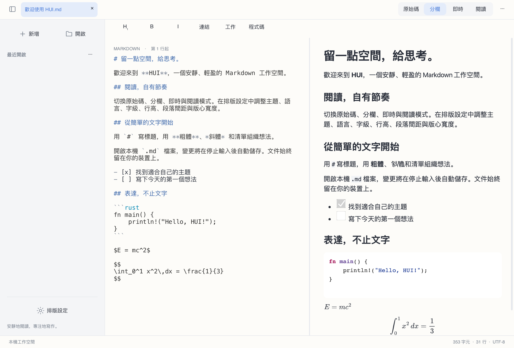

# HUI

[简体中文](README.md) · [繁體中文](README.zh-Hant.md) · [English](README.en.md) · [日本語](README.ja.md) · [한국어](README.ko.md) · [Français](README.fr.md) · [Deutsch](README.de.md) · [Русский](README.ru.md) · [Español](README.es.md)


現代、簡潔、本機優先的 Markdown 編輯與閱讀工具。使用 **Rust + Slint + Blitz/Skia**，不使用 WebView。



## 狀態

**0.2.0 開發預覽**。桌面版可用，仍有明確的未完成項目；Android/iOS 尚無可交付應用程式。

## 功能

- 原始碼、分欄預覽、閱讀及實驗性即時編輯；分欄依捲動比例雙向連動。
- 簡體中文、繁體中文、英語、日語、韓語、法語、德語、俄語、西班牙語介面，預設跟隨系統，可在排版設定中切換。
- UTF-8 多語言 Markdown、程式碼醒目提示、表格、工作清單、本機圖片、數學公式與原生 Mermaid 圖表。
- 暖白、石墨、暖紙主題，獨立原始碼字級、內文行高、段落間距及閱讀寬度設定。
- 本機檔案、多分頁、最近檔案、尋找取代、復原重做、停止輸入後自動儲存、衝突保護與復原。
- 閱讀選取複製、快顯功能表、Markdown 格式快速鍵及 HTML/PDF 匯出。

## 下載與執行

在 [Releases](https://github.com/code592/HUI/releases) 下載對應架構。macOS：開啟 DMG，將 HUI 拖曳至 Applications。Windows：完整解壓縮 ZIP 後執行 hui.exe；請保留旁邊的 DLL 及 assets。Linux：解壓縮 tar.gz，執行 ./bin/hui，先安裝下列相依套件。套件尚未正式簽署或公證。

## 平台

macOS 套件為 Apple Silicon；Windows 與 Linux 提供 x64/ARM64。已在目前 macOS、Windows 11 ARM 虛擬機（x64 透過系統模擬）及 Linux 容器進行基本執行檢查。Windows 10 LTSC 2021 / Windows 10 22H2、macOS 12/Intel、所有實體桌面及行動裝置尚未完整驗收。目標相容性不代表已驗證。

## 語言與字型

首次啟動時介面跟隨系統語言；未支援的語言回退至英語。中文依地區與文字系統辨識簡繁，手動選擇會永久儲存。系統語言於啟動時讀取。切換介面不會翻譯或改寫文件。中日韓文字使用系統後備字型；精簡 Linux 系統應安裝 Noto CJK。原生對話框按鈕由作業系統提供。

## 建置

需要 Rust 1.98+、C/C++ 工具鏈、CMake、Python 3 與平台開發相依套件。Windows 使用 Visual Studio 2022 C++ 工具鏈及對應架構 SDK；可透過 PYTHON3 指定 Python。首次建置會下載相依套件及 Skia 二進位檔。

```sh
cargo run -p hui-app -- path/to/document.md
cargo test --workspace --locked
python3 scripts/check-locales.py
```

Linux (Ubuntu 22.04 / 24.04):

```sh
sudo apt install build-essential clang cmake pkg-config python3 libfontconfig1-dev libxkbcommon-dev libxkbcommon-x11-0 libxcb-shape0-dev libxcb-xfixes0-dev libudev-dev libssl-dev libgl1 libegl1 fonts-noto-cjk
bash scripts/package-linux.sh
```

macOS:

```sh
HUI_DMG=1 bash scripts/package-macos.sh
```

Windows (Visual Studio Developer PowerShell):

```powershell
./scripts/package-windows.ps1 -Arch x64
./scripts/package-windows.ps1 -Arch arm64
```

## 已知限制

原始碼編輯仍採有界分頁檢視，即時模式是單區塊實驗實作；完整連續虛擬編輯、多游標及輸入法跨平台驗收尚未完成。50 MB 首頁、輸入／捲動延遲及耗電目標尚未端到端驗證。Blitz HTML/CSS、merman 與 Mermaid 官方輸出尚未嚴格對照；公式使用 KaTeX 0.16.22 驗證及 MathJax 3.2.2 SVG 顯示，並非嚴格 KaTeX 等效。PDF 公式為向量路徑；連結註釋、複雜分頁及 HTML 匯出資源內嵌仍不完整。原生閱讀停用遠端資源。

PDF 文字複製仍存在少數字形相同但 Unicode 碼位不同的替換（已在部分漢字及俄語字元觀察到），暫不保證匯出後逐字元複製的保真度。

## 開發與授權

HUI 自有原始碼採用 [MIT](LICENSE)。相依套件、字型及附帶資源各自遵循其授權，見 [THIRD_PARTY.md](THIRD_PARTY.md)。歡迎回報問題及提出改善；請提供平台、架構、版本與最小重現文件，並移除私人內容。詳細限制見 [docs/STATUS.md](docs/STATUS.md)。

[](https://slint.dev)
