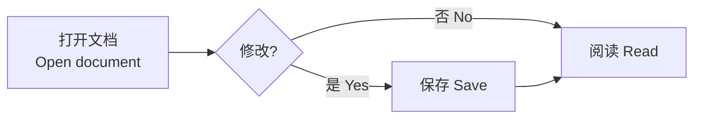
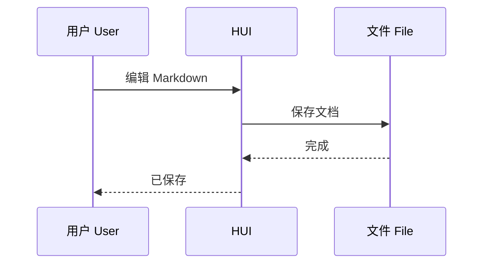

# Mermaid · 原生图表

```mermaid
flowchart LR
    A["打开文档<br/>Open document"] --> B{修改?}
    B -->|是 Yes| C[保存 Save]
    B -->|否 No| D[阅读 Read]
    C --> D
```

```mermaid
sequenceDiagram
    participant U as 用户 User
    participant H as HUI
    participant F as 文件 File
    U->>H: 编辑 Markdown
    H->>F: 保存文档
    F-->>H: 完成
    H-->>U: 已保存
```
