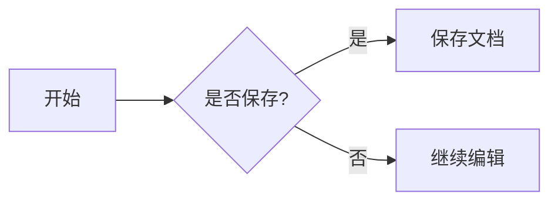
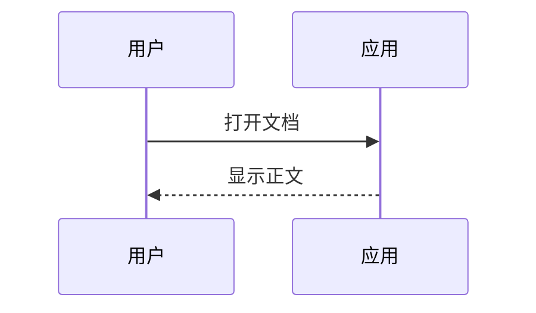

# 原生排版兼容性 / Native document

中文、English、العربية、עברית、देवनागरी、👩‍💻。组合字符：é。

## 内联格式

**粗体**、*斜体*、~~删除线~~、`inline code`、[外部链接](https://example.com)。

> 引用第一行。
>
> 第二段 **强调**。

- [x] 已完成
- [ ] 未完成
  - 嵌套列表

| 列一 | 列二 | 数值 |
| :--- | :---: | ---: |
| 中文 | **居中** | 123 |
| 换行测试 | `code` | 4.5 |

## 数学

行内 $a^2+b^2=c^2$，以及 $\frac{\alpha}{\beta}$。

$$
\begin{aligned}
f(x) &= \int_0^x t^2\,dt \\
     &= \frac{x^3}{3}
\end{aligned}
$$

$$
\begin{pmatrix}1&2\\3&4\end{pmatrix}
$$

## 图表





## 静态 HTML / CSS

<div style="display:flex;gap:16px;padding:16px;border:1px solid #ddd;border-radius:8px"><div style="flex:1">左侧</div><div style="flex:1">右侧</div></div>

<details><summary>展开细节</summary><p>细节内容。</p></details>

## 代码

```rust
fn main() {
    println!("Hello, 世界 👋");
}
```

带脚注的文本[^1]。

[^1]: 脚注内容。
